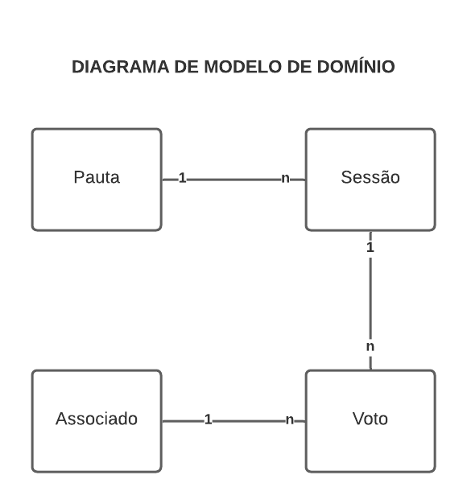
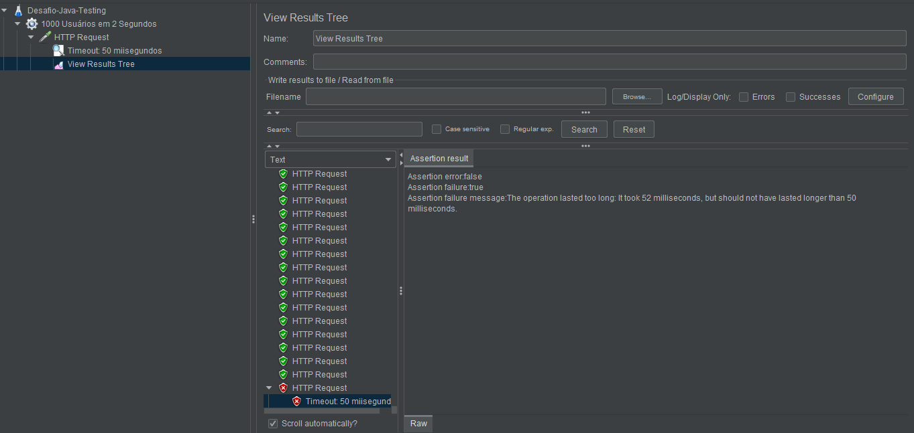

# Desafio Java

No cooperativismo, cada associado possui um voto e as decisões são tomadas em assembleias, por votação. Este desafio de código provê um backend para estas votações.

## Funcionalidades

- POST  - "/api/v1/pauta": Cadastrar uma nova pauta
- POST  - "/api/v1/sessao": Abrir uma sessão de votação em uma pauta. A sessão de votação deve ficar aberta por um tempo determinado na chamada de abertura ou 1 minuto por default - caso o valor definido seja vazio ou menor ou igual a zero.
- GET   - "/api/v1/sessao/{id}/resultado": Contabilizar os votos e dar o resultado da votação na pauta 
- POST  - "/api/v1/voto": Receber votos dos associados em pautas. Os votos são booleanos, cada associado é identificado por um CPF (único) e pode votar apenas uma vez por pauta.

Mais informações técnicas podem ser encontradas no Swagger da API, acessível através do link seguinte (uma vez que esta for executada): http://localhost:8080/swagger-ui.html.

Mais informações sobre o desafio podem ser encontradas no arquivo "External_Utils/Desafio_Técnico.pdf", presente na pasta inicial deste repositório.

## Diagrama do Domínio

A imagem abaixo é uma representação informal que busca auxiliar a compreensão de como os integrantes do domínio deste projeto se comunicam.

## Requisitos para Rodar a Aplicação
- Maven 3.6+
- Java 8
- PostgrSQL instalado na máquina

## Instruções para Rodar a Aplicação

Considerando que todos os requisitos foram supridos, garanta que a configuração do BD está coerente com as definições da sua máquina indo até o arquivo "".

Após isso, execute o projeto da maneira deseja. Se for no Intellij Idea, por exemplo, basta clicar sobre o botão "Run".

Se tudo correr certo, você poderá acessar a API através do endereço "http://localhost:8080".

## Instruções para Testar a Aplicação

Há pelo menos quatro formas de testar esta aplicação (em três tipos de testes diferentes). Escolha a sua:

1. Tipo: testes de funcionamento manuais. Execute os testes através do Postman: para isso, basta importar o arquivo "External_Utils/desafio-java.postman_collection" através do aplicativo referido.

2. Tipo: testes de funcionamento automatizados. Execute o comando "mvn test" caso queira executar os testes automatizados programados.

3. Tipo: testes de funcionamento automatizados. Outra forma de executar os testes automatizados é através da IDE. No Intellij, por exemplo, basta clicar com o botão direito sobre o projeto e selecionar a opção "Run All Tests".

4. Tipo: testes de performance. Os testes de performance aqui feitos utilizaram a ferramenta JMeter (que não está inclusa no projeto). Caso queira executá-los, baixe a ferramenta (https://jmeter.apache.org/download_jmeter.cgi) e utilize o arquivo de configuração "External_Utils/Desafio-Java-Testing.jmx". O teste configurado simula o acesso de 1000 usuários à ferramenta em 2 segundos com um timeout de 50 milissegundos por requisição. Como visto na imagem abaixo, entre as 1000 requisições, só foi registrado um erro (onde o tempo de resposta foi de 52 milissegundos).

## Tecnologias Utilizadas

- Java 8
- Spring
- Maven
- PostgrSQL
- Swagger
- JUnit
- Mockito
- JMeter (externa ao projeto)
- Postman (externa ao projeto)

## Rationale

#### Tecnologias Escolhidas

A Stack aqui utilizada foi escolhida simplesmente por ser moderna e facilitar a construção de sistemas Java. O SBGD (PostgrSQL) foi escolhido simplesmente por ser o único que eu já tinha instalado e configurado em minha máquina.

#### Performance

A ferramenta JMeter foi utilizada por ser comum no mercado e ser de fácil utilização. Os testes foram rodados somente em localhost, todavia, tenho conhecimento de que em um contexto real, para garantir que não há um gargalo do servidor, estes também devem ser executados após a publicação.

#### Versionamento da API

Quanto ao versionamento do código da API: este é feito através do repositório acessado neste momento. Quanto ao versionamento semântico da API: este foi representado através do texto "v1" presente em todas as rotas construídas. Se no futuro uma nova versão de algum endpoint for construída, este pode ter o texto "v2" para identificar que é uma versão diferente.

#### Testes

Tenho conhecimento de que em um contexto real seria ideal construir mais testes. Idealmente, pelo menos a camada Repository deveria ser testada - todavia, foram construídos testes somente para os controllers. O motivo disso foi a falta de tempo (todo o teste foi feito em um final de semana - final de semana este em que tive aulas do mestrado, portanto dividi meu tempo entre as atividades e fiz algumas em paralelo).
